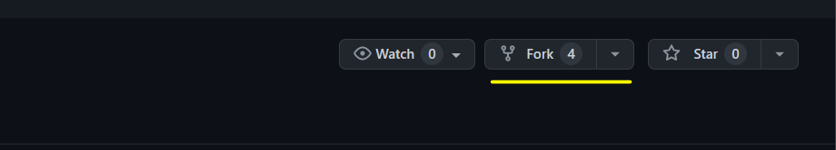
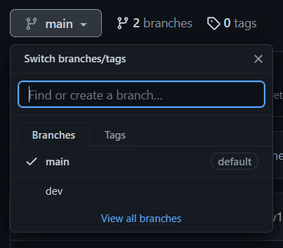

# **CONTRIBUTION GUIDELINES**

To contribute to this repo, you'll first need to `fork` this repo, on the top right of your screen.

Once you've forked the repo, create a new branch called `dev`.
This is where you'll be pushing your changes to be reviewed.

## **Naming Guidelines**
- **Folders**
    - Should be in lowercase. e.g `src`, `assets`.

- **Files**
    - Should be in lowercase. e.g `example.css`.

- **Markdown**
    - Should be capitalized. e.g `README.md`, `CONTRIBUTION.md`
- *Separate words using underscores*(`_`) e.g `my_folder`, `my_file.txt`, `MY_DOCS.md`.   